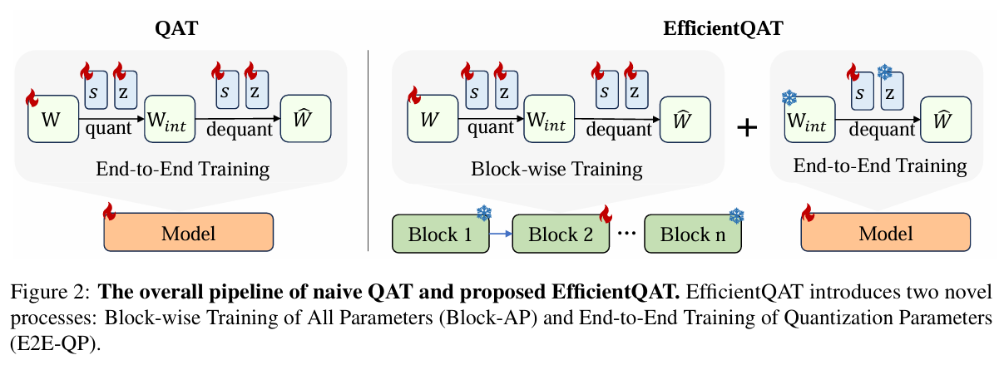

# EfficientQAT
基于EfficientQAT将其改造成训练Qwen3模型。主要需要进行改动的地方是：Qwen3模型在forward的时候需要传入position_embeddings，因此需要修改EfficientQAT\quantize里面的相关实现，具体修改详见文件。同时需要注意：

- 对Chat模型进行QAT的时候使用的仍然是预训练的数据而且没有加入chat_template。
- 计算损失的时候只计算最后一个token对应的损失，其余部分都用-100表示忽略。


## Installation
1. Clone this repository and navigate to EfficientQAT folder
```
cd EfficientQAT
conda create -n efficientqat python==3.11

conda activate efficientqat

pip install -r requirements.txt

pip install transformers==4.53.2
```

## Training

按照EffientQAT的论文，训练分为两个部分：



第一部分逐Block进行训练，权重、scale、zero都进行训练。

第二部分端到端训练，只训练scale。

1. Block-AP

```
bash examples/block_ap/qwen3/w4g128.sh
```

2. E2E-QP

```
bash examples/e2e_qp/qwen3/w4g128-redpajama.sh
```


## Model Transferring
训练完成后进行推理还要进行转换，目前训练保存的权重和AutoAwq的pack的方式是不一样的。需要先将其进行反量化，再量化为AutoAwq对应的格式。

1. 反量化

```
bash examples/model_transfer/fp32_to_16/qwen3.sh
```

2. 再进行量化

为了和PTQ的量化方法进行对比，额外进行其余PTQ相关的量化

### llmc和llm-compressor

#### Quarot-GPTQ

该库主要是进行Quarot训练（离线吸收版本），建议单独构建一个虚拟环境运行。

```
cd llmc
pip install -r requirements.txt

bash scripts/run_llmc.sh configs/quantization/mine/quarot_w.yml
```

运行完之后在保存目录下有个transformed_model，这就是进行了quarot旋转但是没有进行量化的模型。

量化Quarot-GPTQ-W4A16-g128，主要使用的是llm-compressor库，建议也是单独构建一个新的环境。

```
cd llm-compressor

pip install -e .

cd llm-compressor/examples/quantization_w4a16

python3 qwen3_quarot_gptq.py
```

#### AWQ

对于AWQ模型，这里直接使用的是官方的Qwen3-4B-AWQ。

#### EfficientQAT

这里使用llmc作为量化框架，对于两阶段的各自保存的模型，均可以使用：

```
bash scripts/run_llmc.sh configs/quantization/mine/rtn_w.yml
```

## Test

部署的话使用vllm，详情见evalscope_eval下的vllm_service.sh

```
CUDA_VISIBLE_DEVICES=6,7 vllm serve /data/gongoubo/checkpoints/Qwen/Qwen3-4B-AWQ \
--served-model-name  qwen3-4B-awq \
--max-model-len 34000 \
--tensor-parallel-size 2 \
--host 0.0.0.0 \
--port 18003 \
--gpu-memory-utilization 0.85 \
--enforce-eager
```

评测使用evalscope，具体见eval_service.py

以下是测试结果：

首先是我们采样到的数据的分布：

| task_type |     metric      |  dataset_name   | count |
| :-------: | :-------------: | :-------------: | :---: |
|   exam    | AverageAccuracy |      ceval      |  200  |
|   math    |  AveragePass@1  |    math_500     |  200  |
|   exam    | AverageAccuracy |    mmlu_pro     |  200  |
| knowledge |  AveragePass@1  |      gpqa       |  198  |
|   code    |     Pass@1      | live_code_bench |  182  |

训练的结果：

|        Model         | ceval | math_500 | mmlu_pro |  gpqa  | live_code_bench |
| :------------------: | :---: | :------: | :------: | :----: | :-------------: |
|       Qwen3-4B       | 0.855 |  0.935   |  0.715   | 0.5606 |     0.4396      |
|     Qwen3-4B-AWQ     | 0.795 |   0.91   |  0.695   | 0.5253 |     0.3901      |
| Qwen3-4B-Quarot-GPTQ | 0.765 |   0.9    |  0.675   | 0.5253 |     0.3956      |
|    Qwen3-4B-Block    | 0.785 |   0.91   |   0.68   | 0.4899 |     0.3791      |
|     Qwen3-4B-E2e     | 0.775 |   0.89   |   0.64   | 0.4596 |     0.3352      |

QAT的效果还不如PTQ的AWQ。
