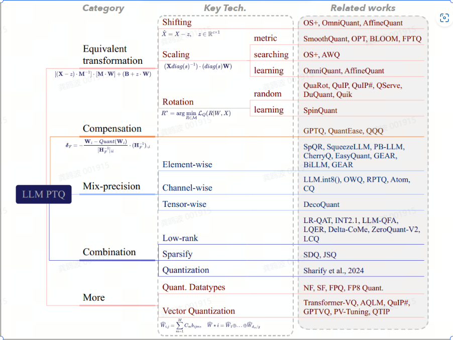

# 综述

-  [Low-bit Model Quantization for Deep Neural Networks: A Survey]([2505.05530](https://arxiv.org/pdf/2505.05530))
- Addressing Activation Outliers in LLMs: A Systematic Review of Post-Training Quantization Techniques
- 另外的一张图，忘了从哪里获取到的了：

# 论文

## 按照会议划分

### ICML2025

|                                                              |
| ------------------------------------------------------------ |
| BoA: Attention-aware Post-training Quantization without Backpropagation |
| Efficient Generative Modeling with Residual Vector Quantization-Based Tokens |
| Layer-wise Quantization for Quantized Optimistic Dual Averaging |
| PARQ: Piecewise-Affine Regularized Quantization              |
| SKIM: Any-bit Quantization Pushing The Limits of Post-Training Quantization |
| CommVQ: Commutative Vector Quantization for KV Cache Compression |
| KVTuner: Sensitivity-Aware Layer-Wise Mixed-Precision KV Cache Quantization for Efficient and Nearly Lossless LLM Inference |
| Q-VDiT: Towards Accurate Quantization and Distillation of Video-Generation Diffusion Transformers |
| SliM-LLM: Salience-Driven Mixed-Precision Quantization for Large Language Models |
| GuidedQuant: Large Language Model Quantization via Exploiting End Loss Guidance |
| BlockDialect: Block-wise Fine-grained Mixed Format Quantization for Energy-Efficient LLM Inference |
| GPTAQ: Efficient Finetuning-Free Quantization for Asymmetric Calibration |
| ResQ: Mixed-Precision Quantization of Large Language Models with Low-Rank Residuals |
| Cache Me If You Must: Adaptive Key-Value Quantization for Large Language Models |
| FlatQuant: Flatness Matters for LLM Quantization             |

### ICLR2025

|                                                              |
| ------------------------------------------------------------ |
| When Attention Sink Emerges in Language Models: An Empirical View |
| SVDQuant: Absorbing Outliers by Low-Rank Component for 4-Bit Diffusion Models |
| QERA: an Analytical Framework for Quantization Error Reconstruction |
| OSTQuant: Refining Large Language Model Quantization with Orthogonal and Scaling Transformations for Better Distribution Fitting |
| CBQ: Cross-Block Quantization for Large Language Models      |
| NestQuant: nested lattice quantization for matrix products and LLMs |

### ACM2025

|                                                              |
| ------------------------------------------------------------ |
| MicroScopiQ: Accelerating Foundational Models through Outlier-Aware Microscaling Quantization |
| Colour quantisation using self-organizing migrating algorithm |
| Optimize Quantization for Large Language Models via Progressive Training |
| NeuronQuant: Accurate and Efficient Post-Training Quantization for Spiking Neural Networks |
| APTQ: Attention-aware Post-Training Mixed-Precision Quantization for Large Language Models |

### arxiv

- FPTQuant: Function-Preserving Transforms for LLM Quantization
- CrossQuant: A Post-Training Quantization Method with Smaller Quantization Kernel for Precise Large Language Model Compression
- Identifying Sensitive Weights via Post-quantization Integral

## 按照机构划分

### MIT HAN Lab

|                                                              |
| ------------------------------------------------------------ |
| Qserve: W4a8kv4 quantization and system co-design for efficient llm serving |
| SmoothQuant: Accurate and Efficient Post-Training Quantization for Large Language Models |
| AWQ: Activation-aware Weight Quantization for LLM Compression and Acceleration |
| SVDQuant: Absorbing Outliers by Low-Rank Components for 4-Bit Diffusion Models |

# 量化工具

目前我们已经使用到的：

- AutoAWQ
- llmc
- llm-compressor
- SpinQuant
- OSTQuant
- ResQuant

# 部署框架

- Text-Inference-Generation(TGI)
- vllm
- sglang
- lmdeploy
- llama.cpp
- ktransformers